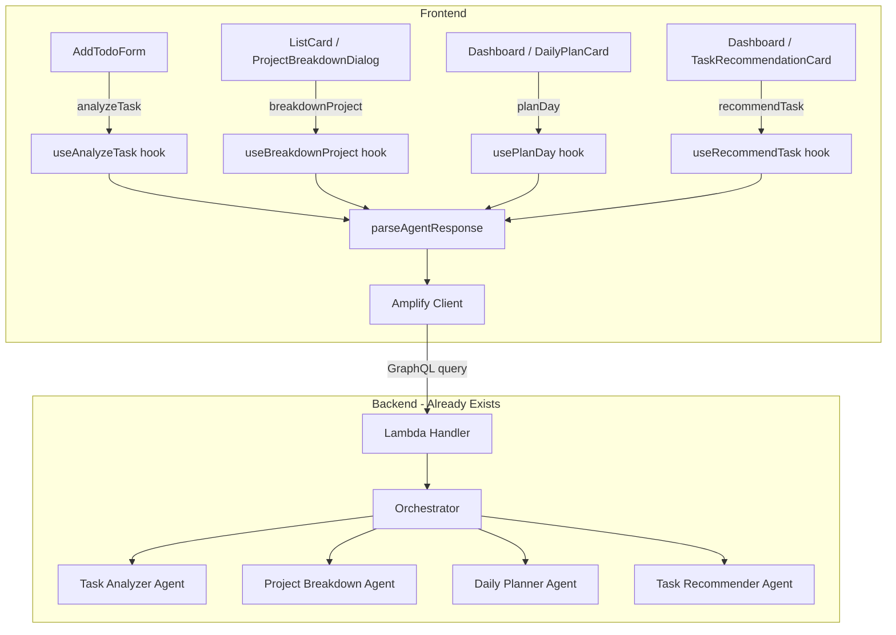

# Design Document: AI Todo Assistant

## Overview

This feature adds four AI-powered capabilities to the existing todo app, all driven by user-initiated actions. The backend agent infrastructure (Strands agents, Lambda, Amplify queries) is already in place. This design covers the frontend integration: new React hooks wrapping each Amplify query, a response parsing layer, UI components using shadcn, and wiring into the existing AddTodoForm, ListCard, and Dashboard.

The key architectural decision is to keep AI interactions stateless and on-demand — no background polling, no automatic triggers. Each AI action is a single request-response cycle initiated by a button click.

## Architecture



### Data Flow

1. User clicks an AI action button
2. React hook calls the corresponding Amplify query via `client.queries.*`
3. Lambda handler routes to the appropriate agent
4. Agent returns a JSON string response
5. Hook parses the response using the shared parser
6. Component renders the parsed result for user review/action

## Components and Interfaces

### Response Parser (`src/lib/ai-response-parser.ts`)

A shared utility for parsing and validating JSON responses from all agents.

```typescript
// Agent response types
interface TaskAnalysis {
  priority: 'high' | 'medium' | 'low';
  estimatedMinutes: number;
  dueDate: string | null;
  tags: string[];
  reasoning: string;
}

interface ProjectBreakdownTask {
  title: string;
  description?: string;
  priority?: 'LOW' | 'MEDIUM' | 'HIGH' | 'URGENT';
  dueDate?: string;
  tags?: string[];
  effortHours?: number;
}

interface ProjectBreakdownResult {
  tasks: ProjectBreakdownTask[];
  summary: string;
}

interface DailyPlanTask {
  taskId: string;
  title: string;
  priority: string;
  reasoning: string;
  estimatedMinutes?: number;
}

interface DailyPlanResult {
  tasks: DailyPlanTask[];
  summary: string;
}

interface TaskRecommendation {
  taskId: string;
  title: string;
  reasoning: string;
  priority: string;
}

type ParseResult<T> =
  | { success: true; data: T }
  | { success: false; error: string };

// Core functions
function parseTaskAnalysis(raw: string): ParseResult<TaskAnalysis>;
function parseProjectBreakdown(raw: string): ParseResult<ProjectBreakdownResult>;
function parseDailyPlan(raw: string): ParseResult<DailyPlanResult>;
function parseTaskRecommendation(raw: string): ParseResult<TaskRecommendation>;
function prettyPrint<T>(data: T): string;
```

### Agent Hooks (`src/hooks/use-ai-agents.ts`)

Each hook wraps an Amplify query with loading/error/result state using TanStack Query's `useMutation`.

```typescript
// useAnalyzeTask - wraps analyzeTask query
function useAnalyzeTask(): {
  analyze: (taskDescription: string) => void;
  data: TaskAnalysis | null;
  isLoading: boolean;
  error: string | null;
  reset: () => void;
};

// useBreakdownProject - wraps breakdownProject query
function useBreakdownProject(): {
  breakdown: (listId: string, projectBrief: string, deadline?: string) => void;
  data: ProjectBreakdownResult | null;
  isLoading: boolean;
  error: string | null;
  reset: () => void;
};

// usePlanDay - wraps planDay query
function usePlanDay(): {
  plan: (date: string, listId?: string) => void;
  data: DailyPlanResult | null;
  isLoading: boolean;
  error: string | null;
  reset: () => void;
};

// useRecommendTask - wraps recommendTask query
function useRecommendTask(): {
  recommend: (listId?: string) => void;
  data: TaskRecommendation | null;
  isLoading: boolean;
  error: string | null;
  reset: () => void;
};
```

### UI Components

All components use existing shadcn primitives (Button, Card, Dialog, Input, Select, Skeleton, Badge).

#### 1. AI Assist Button on AddTodoForm

Added to the existing `AddTodoForm`. When the user has typed a description, they can click an AI wand icon button. The analyzer response pre-fills priority, tags, and dueDate. A new priority Select field is added to the form.

- Uses: `Button`, `Select`, `Badge` (for showing AI-suggested tag), existing form `Input`
- Location: Integrated into `src/components/todo/AddTodoForm.tsx`

#### 2. Project Breakdown Dialog (`src/components/ai/ProjectBreakdownDialog.tsx`)

A shadcn `Dialog` triggered from the ListCard. Contains:
- `Input` for project brief (required)
- `Input` for deadline (optional, datetime-local)
- `Button` to submit
- Results view: list of generated tasks with checkboxes to select/deselect before confirming
- `Button` to confirm and add selected tasks to the list

#### 3. Daily Plan Card (`src/components/ai/DailyPlanCard.tsx`)

A `Card` on the dashboard with a "Plan My Day" `Button`. When clicked, shows a loading `Skeleton`, then renders the prioritized task list. Includes optional list filter via `Select`.

#### 4. Task Recommendation Card (`src/components/ai/TaskRecommendationCard.tsx`)

A `Card` on the dashboard with a "What Should I Do Next?" `Button`. When clicked, shows a loading `Skeleton`, then renders the recommended task with reasoning.

### Priority Mapping

The Task Analyzer returns lowercase priorities (`high`, `medium`, `low`). The TodoItem model uses uppercase enums (`HIGH`, `MEDIUM`, `LOW`, `URGENT`). Mapping:

```typescript
function mapAnalyzerPriority(priority: 'high' | 'medium' | 'low'): 'HIGH' | 'MEDIUM' | 'LOW' {
  const map = { high: 'HIGH', medium: 'MEDIUM', low: 'LOW' } as const;
  return map[priority];
}
```

## Data Models

### Existing Models (No Changes)

- `TodoItem` — already has `priority: enum(['LOW', 'MEDIUM', 'HIGH', 'URGENT'])`, `tags`, `dueDate`, `description`, `effortHours`
- `TodoList` — no changes needed
- Amplify queries (`analyzeTask`, `breakdownProject`, `planDay`, `recommendTask`) — already defined in `amplify/data/resource.ts`

### New Types (Frontend Only)

All new types are defined in `src/lib/ai-response-parser.ts` as shown in the Components section above. These are purely frontend types for parsing agent responses — no backend schema changes needed.

### AddTodoForm Props Extension

The `AddTodoForm` `onAdd` callback needs to accept an optional `priority` parameter:

```typescript
interface AddTodoFormProps {
  onAdd: (
    title: string,
    description?: string,
    tags?: string[],
    dueDate?: string,
    reminderMinutes?: number,
    priority?: 'LOW' | 'MEDIUM' | 'HIGH' | 'URGENT'
  ) => void;
  isLoading?: boolean;
  defaultReminderMinutes?: number;
}
```


## Correctness Properties

*A property is a characteristic or behavior that should hold true across all valid executions of a system — essentially, a formal statement about what the system should do. Properties serve as the bridge between human-readable specifications and machine-verifiable correctness guarantees.*

### Property 1: Priority mapping correctness

*For any* valid Task_Analyzer priority value (`high`, `medium`, `low`), the `mapAnalyzerPriority` function SHALL return the corresponding TodoItem priority enum value (`HIGH`, `MEDIUM`, `LOW`), and for any string that is not one of those three values, the function SHALL return a defined default.

**Validates: Requirements 1.6**

### Property 2: Valid JSON parsing produces typed objects

*For any* valid JSON string that conforms to a known agent response schema (TaskAnalysis, ProjectBreakdownResult, DailyPlanResult, TaskRecommendation), the corresponding parse function SHALL return a success result containing a typed object with all required fields present and correctly typed.

**Validates: Requirements 6.1**

### Property 3: Invalid JSON returns parse error

*For any* string that is not valid JSON, all parse functions (parseTaskAnalysis, parseProjectBreakdown, parseDailyPlan, parseTaskRecommendation) SHALL return a failure result with a descriptive error message.

**Validates: Requirements 6.2**

### Property 4: Missing required fields returns validation error

*For any* valid JSON object that is missing one or more required fields for a given agent response type, the corresponding parse function SHALL return a failure result with an error message identifying the missing fields.

**Validates: Requirements 6.3, 6.4**

### Property 5: Parse/prettyPrint round-trip

*For any* valid AI response object (TaskAnalysis, ProjectBreakdownResult, DailyPlanResult, or TaskRecommendation), calling `prettyPrint` on the object and then parsing the resulting string with the corresponding parse function SHALL produce an object equivalent to the original.

**Validates: Requirements 6.6**

## Error Handling

### Parser Errors

- Invalid JSON: Return `{ success: false, error: "Invalid JSON: <parse error message>" }`
- Missing required fields: Return `{ success: false, error: "Missing required fields: <field list>" }`
- Wrong field types: Return `{ success: false, error: "Invalid field type: <field> expected <type>" }`

### Hook Errors

- Network/Amplify errors: Caught by TanStack Query's `onError`, surfaced via `error` state
- Parse errors: Caught in the mutation function, set as error state with the parser's error message
- Duplicate invocations: Prevented by checking `isPending` before calling `mutateAsync`

### UI Error Display

- All AI action components show error messages using a styled error div (red background, descriptive text)
- All error states include a "Retry" button that calls `reset()` on the hook and allows re-invocation
- Original user input is preserved on error (form fields are not cleared until successful submission)

## Testing Strategy

### Property-Based Tests

Use `fast-check` as the property-based testing library. Each property test runs a minimum of 100 iterations.

Property tests target the `ai-response-parser.ts` module since it contains the pure functions most amenable to property-based testing:

- **Property 1**: Generate all valid priority strings, verify mapping output
- **Property 2**: Generate valid agent response objects, serialize to JSON, verify parsing succeeds with correct types
- **Property 3**: Generate arbitrary non-JSON strings, verify all parsers return failure
- **Property 4**: Generate valid JSON objects with random fields removed, verify parsers return failure with field names
- **Property 5**: Generate valid response objects, prettyPrint then parse, verify equivalence

Tag format: `Feature: ai-todo-assistant, Property N: <property text>`

### Unit Tests

Unit tests complement property tests for specific examples and edge cases:

- Parser edge cases: empty string, `null`, `undefined`, nested JSON with extra fields
- Priority mapping: explicit test for each of the 3 values plus an unknown value
- Hook behavior: mock Amplify client, verify correct query is called with correct arguments
- Component integration: verify form fields are pre-filled after successful analysis

### Test Configuration

- Framework: Vitest (already configured in the project)
- Property library: `fast-check`
- Minimum iterations: 100 per property test
- Each property test references its design document property number in a comment
