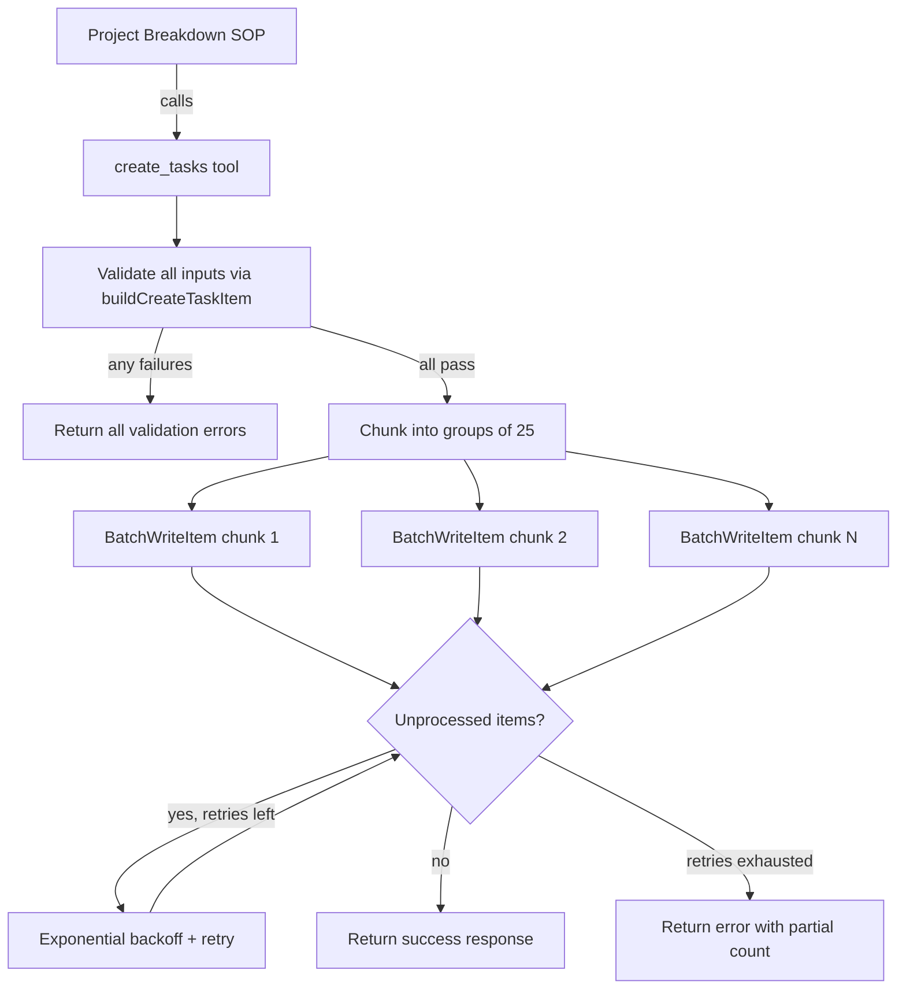

# Design Document: Batch Create Tasks

## Overview

This feature adds a `create_tasks` batch tool to the task-agents Lambda function. The tool accepts an array of task inputs along with a shared `listId`, validates all inputs using the existing `buildCreateTaskItem` helper, and writes them to DynamoDB using `BatchWriteItem` (chunked into groups of 25). The tool is registered in the handler alongside existing tools, and the Project Breakdown SOP is updated to use it instead of calling `create_task` in a loop.

## Architecture

The batch tool follows the same architecture as the existing tools:



The tool lives in `amplify/functions/task-agents/tools/create-tasks.ts` (plural) alongside the existing `create-task.ts` (singular). It imports `buildCreateTaskItem` from the single-task module to reuse validation and item construction logic.

## Components and Interfaces

### 1. `create-tasks.ts` — Batch Tool Module

**File:** `amplify/functions/task-agents/tools/create-tasks.ts`

```typescript
export interface CreateTasksInput {
  listId: string;
  tasks: Array<{
    title: string;
    description?: string;
    status?: string;
    priority?: string;
    effortHours?: number;
    dueDate?: string;
    tags?: string[];
    reminderMinutes?: number;
  }>;
}

export interface CreateTasksResult {
  success: boolean;
  createdCount: number;
  items?: Record<string, unknown>[];
  errors?: string[];
  error?: string;
}
```

**Key function:**

```typescript
export async function createTasks(
  input: CreateTasksInput,
  docClient: DynamoDBDocumentClient,
  tableName: string,
  owner: string,
): Promise<CreateTasksResult>
```

**Behavior:**
1. Validate every task by calling `buildCreateTaskItem({ ...task, listId: input.listId }, owner)` for each entry.
2. If any validation fails, return immediately with `success: false` and all collected error messages. No items are written.
3. Chunk validated items into groups of 25.
4. For each chunk, call `BatchWriteItem`. If `UnprocessedItems` are returned, retry with exponential backoff (delays: 100ms, 200ms, 400ms) up to 3 attempts.
5. If retries are exhausted and unprocessed items remain, return an error with the count of successfully written items.
6. On full success, return `success: true`, `createdCount`, and the array of created items.

### 2. Handler Registration

**File:** `amplify/functions/task-agents/handler.ts`

A new `FunctionTool` instance `createTasksTool` is created with:
- `name`: `'create_tasks'`
- `inputSchema`: object with required `listId` (string) and `tasks` (array of task objects)
- `callback`: delegates to `createTasks()` with the shared `docClient`, `todoItemTable`, and `'agent'` owner

The tool is added to the `tools` map passed to `createOrchestrator`.

### 3. Project Breakdown SOP Update

**File:** `amplify/functions/task-agents/sops/project-breakdown.md`

Changes:
- Add `create_tasks` to the tools frontmatter (remove `create_task` since the batch tool replaces it for this agent)
- Update Step 4 to instruct the agent to collect all decomposed tasks into an array, then call `create_tasks` once with the `listId` and the full array
- Keep `get_lists` for list verification

## Data Models

### DynamoDB Task Item (unchanged)

Each task item written to DynamoDB has the same shape as the existing `create_task` tool produces via `buildCreateTaskItem`:

| Field | Type | Source |
|-------|------|--------|
| `id` | string (UUID) | Generated by `buildCreateTaskItem` |
| `owner` | string | Passed as `'agent'` from handler |
| `title` | string | From task input (required) |
| `listId` | string | From top-level `CreateTasksInput.listId` |
| `description` | string | Optional |
| `status` | enum string | Optional, validated |
| `priority` | enum string | Optional, validated |
| `effortHours` | number | Optional |
| `dueDate` | string (ISO 8601) | Optional |
| `tags` | string[] | Optional |
| `reminderMinutes` | number | Optional |
| `reminderSent` | boolean | Optional |
| `completedAt` | string | Optional |
| `createdAt` | string (ISO 8601) | Generated |
| `updatedAt` | string (ISO 8601) | Generated |

### BatchWriteItem Request Shape

Each chunk produces a `BatchWriteCommand` with:

```typescript
{
  RequestItems: {
    [tableName]: items.map(item => ({
      PutRequest: { Item: item }
    }))
  }
}
```


## Correctness Properties

*A property is a characteristic or behavior that should hold true across all valid executions of a system — essentially, a formal statement about what the system should do. Properties serve as the bridge between human-readable specifications and machine-verifiable correctness guarantees.*

### Property 1: Item construction consistency

*For any* array of task inputs and a valid listId, each item produced by the batch tool should be identical to the item produced by calling `buildCreateTaskItem({ ...task, listId }, owner)` directly for that same task input (given the same UUID and timestamp).

**Validates: Requirements 1.1, 4.2**

### Property 2: Correct chunking

*For any* array of N valid task inputs where N > 0, the batch tool should produce exactly `Math.ceil(N / 25)` `BatchWriteItem` requests, each containing at most 25 items, and the total number of items across all requests should equal N.

**Validates: Requirements 1.2, 1.3**

### Property 3: All-or-nothing validation

*For any* array of task inputs containing at least one invalid task (missing title, invalid status, invalid priority), the batch tool should return `success: false` with error messages for every invalid task, and zero DynamoDB write calls should be made.

**Validates: Requirements 1.5**

### Property 4: Success response count matches input

*For any* array of N valid task inputs that are all successfully written, the batch tool should return `success: true`, `createdCount` equal to N, and an `items` array of length N.

**Validates: Requirements 1.6**

## Error Handling

| Scenario | Behavior |
|----------|----------|
| Empty tasks array | Return `success: false` with error "tasks array is empty" |
| Any task fails validation | Return `success: false` with all validation errors, no writes |
| DynamoDB `BatchWriteItem` throws | Return `success: false` with error message and count of items written before failure |
| `UnprocessedItems` returned | Retry with exponential backoff (100ms, 200ms, 400ms), up to 3 attempts |
| Retries exhausted with remaining unprocessed items | Return `success: false` with error and count of successfully written items |

## Testing Strategy

### Property-Based Tests

Use `fast-check` as the property-based testing library. Each property test runs a minimum of 100 iterations.

- **Property 1** tests that the batch tool delegates to `buildCreateTaskItem` correctly by comparing outputs for randomly generated task inputs.
- **Property 2** tests chunking logic with randomly sized arrays (1–100 items) and verifies chunk count and sizes.
- **Property 3** tests that arrays with random invalid entries produce no writes and return all errors.
- **Property 4** tests that successful writes return the correct count and items array length.

Each test is tagged with: `Feature: batch-create-tasks, Property {N}: {title}`

### Unit Tests

Unit tests complement property tests for specific scenarios:

- Retry behavior when DynamoDB returns `UnprocessedItems` (mocked)
- DynamoDB failure mid-batch returns partial success count (mocked)
- Empty array input returns error
- Handler registers `create_tasks` tool with correct schema
- Existing `create_task` tool remains registered and functional

### Test Configuration

- Library: `fast-check` for property-based tests, `vitest` for unit tests
- Minimum 100 iterations per property test
- DynamoDB calls mocked via `aws-sdk-client-mock` or manual mocks
