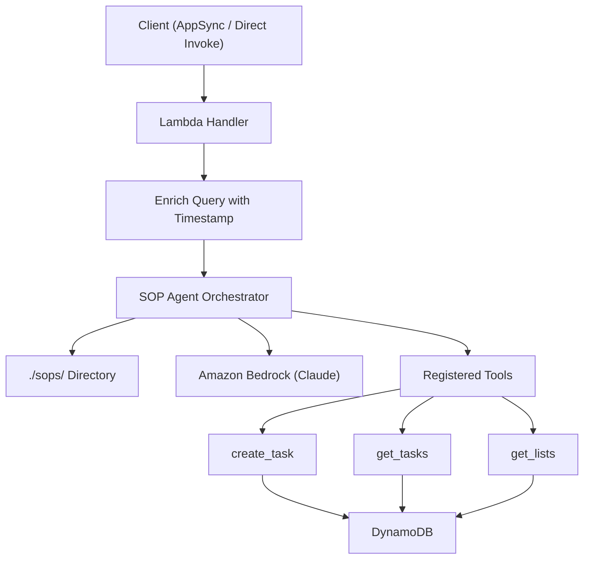

# Design Document: Task Agents

## Overview

This design adds a Lambda function (`task-agents`) to the Amplify Gen2 backend that hosts an AI agent powered by `@serverless-dna/sop-agents`. The agent orchestrator loads SOPs from a bundled `./sops/` directory, registers three tools (`create_task`, `get_tasks`, `get_lists`) that operate on DynamoDB tables via the AWS SDK, and uses Amazon Bedrock Claude for inference. The handler enriches every user query with current date/time context before invoking the orchestrator.

The function follows the existing pattern established by `accept-invitation`: defined via `defineFunction`, registered in `backend.ts`, with DynamoDB table access granted via IAM and table names passed as environment variables.

## Architecture



The Lambda handler is the entry point. On each invocation:
1. The handler captures the current timestamp and enriches the user query with date/time context
2. The orchestrator is initialized with SOPs loaded from `./sops/` and the three registered tools
3. The orchestrator invokes Bedrock Claude, which may call tools as needed
4. The orchestrator returns the final result to the caller

## Components and Interfaces

### 1. Function Definition (`resource.ts`)

Defines the Lambda using `defineFunction` from `@aws-amplify/backend`:

```typescript
import { defineFunction } from '@aws-amplify/backend';

export const taskAgents = defineFunction({
  name: 'task-agents',
  entry: './handler.ts',
  timeoutSeconds: 60,
  memoryMB: 512,
  resourceGroupName: 'data',
});
```

Key decisions:
- `resourceGroupName: 'data'` — groups with the data stack to avoid circular dependencies when accessing DynamoDB tables (same pattern as `accept-invitation`)
- `timeoutSeconds: 60` — agent invocations with Bedrock can take significant time
- `memoryMB: 512` — default, sufficient for SDK operations

### 2. Backend Registration (`backend.ts`)

The function is registered in `backend.ts` and granted access to DynamoDB tables:

```typescript
import { taskAgents } from './functions/task-agents/resource';

// In defineBackend:
const backend = defineBackend({
  auth, data, acceptInvitation, taskAgents,
});

// Grant DynamoDB access
const todoItemTable = backend.data.resources.tables['TodoItem'];
const todoListTable = backend.data.resources.tables['TodoList'];

todoItemTable.grantReadWriteData(backend.taskAgents.resources.lambda);
todoListTable.grantReadData(backend.taskAgents.resources.lambda);

// Pass table names
backend.taskAgents.addEnvironment('TODOITEM_TABLE_NAME', todoItemTable.tableName);
backend.taskAgents.addEnvironment('TODOLIST_TABLE_NAME', todoListTable.tableName);

// Grant Bedrock permissions
backend.taskAgents.resources.lambda.addToRolePolicy(
  new PolicyStatement({
    effect: Effect.ALLOW,
    actions: ['bedrock:InvokeModel', 'bedrock:InvokeModelWithResponseStream'],
    resources: ['arn:aws:bedrock:*::foundation-model/anthropic.claude-*'],
  })
);
```

Design decisions:
- TodoList table gets read-only access (agent only queries lists, never creates them)
- TodoItem table gets read-write access (agent creates and queries items)
- Bedrock permissions use a wildcard for Claude model variants to support model upgrades

### 3. Lambda Handler (`handler.ts`)

The handler is the core orchestration point:

```typescript
import { Orchestrator } from '@serverless-dna/sop-agents';

export const handler = async (event: { arguments: { query: string } }) => {
  const orch = new Orchestrator({
    sopDir: './sops',
    tools: [createTaskTool, getTasksTool, getListsTool],
  });

  const now = new Date();
  const timestamp = now.toISOString();
  const dateOnly = now.toISOString().split('T')[0];
  const timeOnly = now.toTimeString().split(' ')[0];
  const dayOfWeek = now.toLocaleDateString('en-US', { weekday: 'long' });

  const queryWithContext = `Current Date and Time: ${timestamp}\nDate: ${dateOnly} (${dayOfWeek})\nTime: ${timeOnly}\nUser Query: ${event.arguments.query}`;

  return await orch.invoke(queryWithContext);
};
```

### 4. Tool Implementations

Each tool is a function registered with the orchestrator that uses the DynamoDB Document Client.

#### create_task Tool

```typescript
// Accepts: title (required), listId (required), description, status, dueDate, tags, reminderMinutes
// Returns: the created TodoItem record
// Generates a UUID for the item id
// Sets owner field for authorization
```

Input validation:
- `title` and `listId` are required — return error if missing
- Unknown fields (priority, estimatedMinutes, order) are ignored with a warning log
- `status` must be one of: PENDING, IN_PROGRESS, COMPLETE

#### get_tasks Tool

```typescript
// Accepts: listId, status, dueDate (optional filters)
// Returns: array of matching TodoItems
// Uses secondary indexes when filtering by listId or status
```

Query strategy:
- If `listId` provided: use `byList` GSI (partition: listId, sort: dueDate)
- If `status` provided: use `byStatus` GSI (partition: status, sort: dueDate)
- If both provided: use `byList` GSI with a filter expression on status
- If neither: scan the table (acceptable for agent use cases with small datasets)

#### get_lists Tool

```typescript
// Accepts: no parameters
// Returns: array of TodoLists with id, name, description
```

Uses a DynamoDB scan on the TodoList table. Returns id, name, and description for each list.

### 5. SOP Directory and Packaging

The `./sops/` directory lives at `amplify/functions/task-agents/sops/` and contains SOP markdown/text files that guide the agent's behavior.

For packaging, Amplify Gen2's `defineFunction` uses esbuild which only bundles TypeScript/JavaScript. The `./sops/` directory contains non-code assets that need to be copied into the Lambda deployment package.

Approach: Use esbuild's `copyFiles` or a post-build hook. In Amplify Gen2, the recommended approach for non-code assets is to use the `bundling.commandHooks` on the underlying CDK construct. We access this via `backend.taskAgents.resources.lambda` and add a `beforeBundling` or `afterBundling` hook to copy the `./sops/` directory.

Alternative simpler approach: Import SOP content as string constants at build time using a TypeScript file that reads and exports them. This avoids bundling complexity entirely.

Recommended approach: Use the CDK construct override to add command hooks for copying the sops directory into the bundle output. This is done in `backend.ts` after the function is defined:

```typescript
import { NodejsFunction } from 'aws-cdk-lib/aws-lambda-nodejs';
import * as path from 'path';

const fnConstruct = backend.taskAgents.resources.lambda.node.defaultChild as NodejsFunction;
// Override bundling to include sops directory via command hooks
```

If CDK construct overrides prove too complex, the fallback is to embed SOP content directly in TypeScript files.

## Data Models

### TodoItem (existing — no changes)

| Field | Type | Required | Notes |
|-------|------|----------|-------|
| id | string | auto | Generated UUID |
| title | string | yes | Task title |
| description | string | no | Task description |
| status | enum | no | PENDING, IN_PROGRESS, COMPLETE |
| priority | enum | no | LOW, MEDIUM, HIGH, URGENT |
| effortHours | float | no | Estimated effort in hours |
| dueDate | datetime | no | Due date |
| completedAt | datetime | no | Completion timestamp |
| tags | string[] | no | Tag array |
| reminderMinutes | integer | no | Minutes before due date |
| reminderSent | boolean | no | Default false |
| listId | id | yes | FK to TodoList |
| owner | string | auto | Cognito sub claim |

### TodoList (existing — no changes)

| Field | Type | Required | Notes |
|-------|------|----------|-------|
| id | string | auto | Generated UUID |
| name | string | yes | List name |
| description | string | no | List description |
| sortOrder | integer | no | Default 0 |
| groupId | id | no | FK to ListGroup |
| owner | string | auto | Cognito sub claim |

### Secondary Indexes Used

- `TodoItem.byList`: partition=listId, sort=dueDate
- `TodoItem.byStatus`: partition=status, sort=dueDate

### Tool Input Schemas

#### create_task Input
```typescript
interface CreateTaskInput {
  title: string;       // required
  listId: string;      // required
  description?: string;
  status?: 'PENDING' | 'IN_PROGRESS' | 'COMPLETE';
  priority?: 'LOW' | 'MEDIUM' | 'HIGH' | 'URGENT';
  effortHours?: number;
  dueDate?: string;    // ISO 8601 datetime
  tags?: string[];
  reminderMinutes?: number;
}
```

#### get_tasks Input
```typescript
interface GetTasksInput {
  listId?: string;
  status?: 'PENDING' | 'IN_PROGRESS' | 'COMPLETE';
  dueDateBefore?: string;  // ISO 8601
  dueDateAfter?: string;   // ISO 8601
}
```

#### get_lists Input
```typescript
// No input parameters
interface GetListsInput {}
```


## Correctness Properties

*A property is a characteristic or behavior that should hold true across all valid executions of a system — essentially, a formal statement about what the system should do. Properties serve as the bridge between human-readable specifications and machine-verifiable correctness guarantees.*

### Property 1: Query enrichment produces correct format

*For any* user query string and any valid Date object, the enrichment function should produce a string matching the template `Current Date and Time: {iso}\nDate: {YYYY-MM-DD} ({dayOfWeek})\nTime: {HH:MM:SS}\nUser Query: {originalQuery}` where the ISO timestamp, date, day of week, and time are derived from the given Date, and the original query appears verbatim at the end.

**Validates: Requirements 2.4, 2.5**

### Property 2: create_task round trip

*For any* valid CreateTaskInput (containing at least title and listId, plus any combination of optional schema fields), calling `create_task` should produce a DynamoDB PutItem call whose item contains all provided input fields, and the returned object should contain those same field values.

**Validates: Requirements 3.2, 3.3**

### Property 3: create_task rejects missing required fields

*For any* input that is missing `title`, missing `listId`, or missing both, calling `create_task` should return an error message and should not issue a DynamoDB PutItem call.

**Validates: Requirements 3.4**

### Property 4: get_tasks filter correctness

*For any* set of TodoItems and any combination of filter parameters (listId, status, dueDateBefore, dueDateAfter), every item returned by `get_tasks` should match all specified filters. When no filters are specified, all items should be returned.

**Validates: Requirements 4.3, 4.4**

### Property 5: get_lists returns id and name

*For any* set of TodoLists in the database, every object returned by `get_lists` should contain at least the `id` and `name` fields from the original list.

**Validates: Requirements 5.2**

### Property 6: Unknown fields are stripped from create_task

*For any* input to `create_task` that includes fields not in the TodoItem schema (e.g., priority, estimatedMinutes, order), the DynamoDB PutItem call should not contain those unknown fields, and the tool should still succeed for otherwise valid inputs.

**Validates: Requirements 7.1, 7.3**

### Property 7: get_tasks ignores unknown filter fields

*For any* filter input to `get_tasks` that includes fields not in the supported filter set (listId, status, dueDate range), those unknown fields should have no effect on the query, and the tool should behave as if only the known filter fields were provided.

**Validates: Requirements 7.2**

## Error Handling

| Scenario | Behavior |
|----------|----------|
| Missing required field in `create_task` (title or listId) | Return descriptive error, do not write to DynamoDB |
| Unknown fields in tool input | Strip unknown fields, log warning, proceed with known fields |
| Invalid `status` enum value in `create_task` | Return error describing valid values |
| DynamoDB operation failure | Catch error, return descriptive error message to orchestrator |
| Bedrock invocation failure | Let orchestrator handle; error propagates as Lambda response |
| Missing environment variables (table names) | Fail fast at handler initialization with clear error message |
| Empty or missing `./sops/` directory | Let orchestrator handle; may fail at initialization |
| Invalid dueDate format in filters | Return error describing expected ISO 8601 format |

## Testing Strategy

### Property-Based Testing

Library: **fast-check** (TypeScript property-based testing library)

Each correctness property will be implemented as a property-based test with a minimum of 100 iterations. Tests will use mocked DynamoDB clients to isolate tool logic from infrastructure.

Configuration:
- Minimum 100 iterations per property test
- Each test tagged with: **Feature: task-agents, Property {N}: {title}**
- Use `fast-check` arbitraries to generate random valid/invalid inputs

### Unit Testing

Unit tests complement property tests by covering:
- Specific examples of query enrichment with known dates
- Edge cases: empty strings, very long queries, special characters in task titles
- DynamoDB error simulation (ConditionalCheckFailedException, etc.)
- Integration between handler and orchestrator (mocked orchestrator)

### Test Structure

```
amplify/functions/task-agents/
├── handler.ts
├── resource.ts
├── package.json
├── tools/
│   ├── create-task.ts
│   ├── get-tasks.ts
│   └── get-lists.ts
├── sops/
│   └── (SOP files)
└── __tests__/
    ├── enrich-query.test.ts
    ├── create-task.test.ts
    ├── get-tasks.test.ts
    └── get-lists.test.ts
```

Each test file contains both unit tests (specific examples) and property tests (universal properties). The DynamoDB client is mocked in all tests to avoid infrastructure dependencies.
