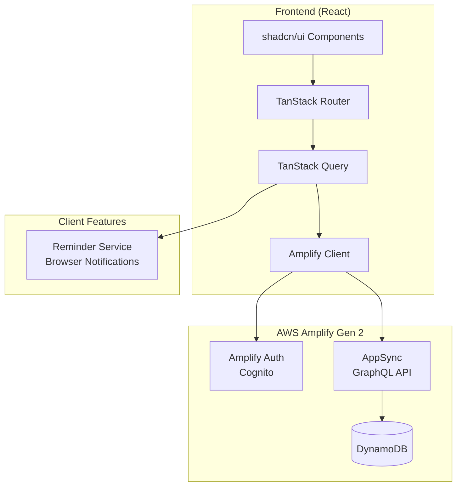
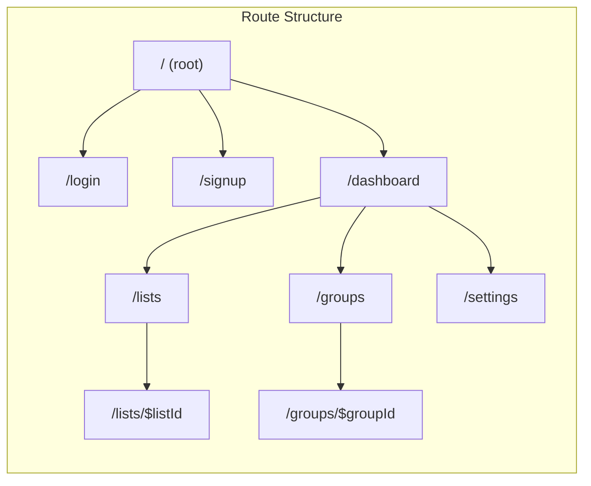
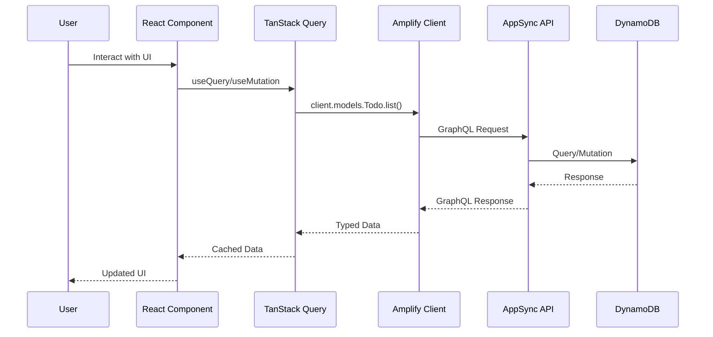
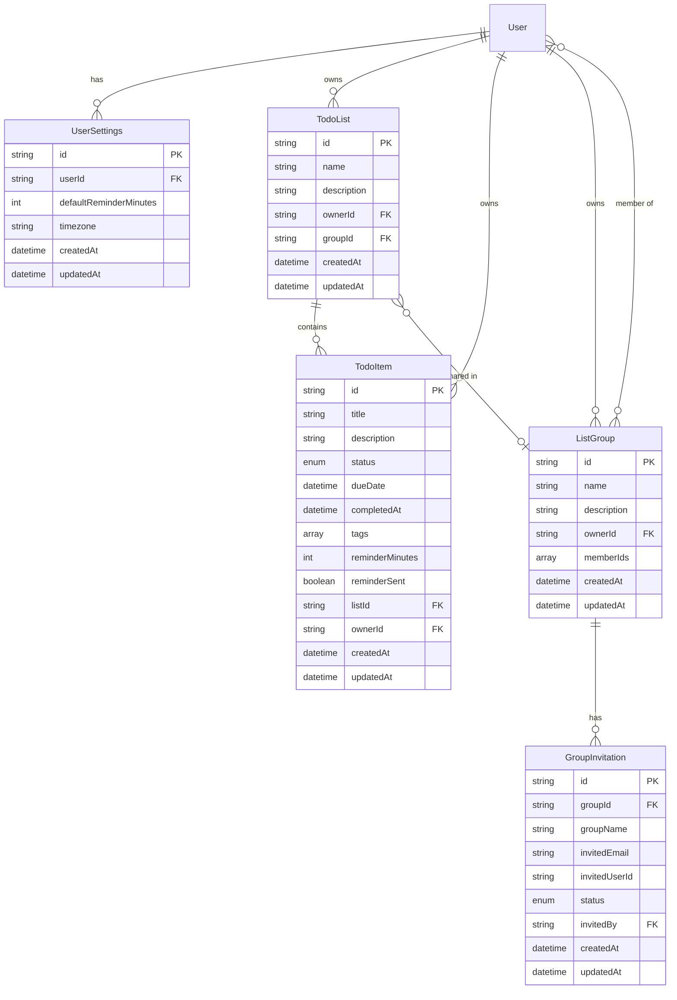

# Design Document: Todo App

## Overview

This design describes a to-do management application built with React frontend and AWS Amplify Gen 2 backend. The application enables users to manage personal tasks, organize them into lists, collaborate through shared groups, and receive timely reminders.

The architecture follows a progressive implementation approach:
1. **Phase 1 (MVP)**: Authentication + Basic Todo CRUD
2. **Phase 2**: Lists and organization
3. **Phase 3**: Groups and sharing
4. **Phase 4**: Tags, reminders, and advanced features

### Key Design Decisions

1. **Amplify Gen 2 TypeScript-first approach**: All backend resources defined in TypeScript for type safety and IntelliSense support
2. **TanStack Router file-based routing**: Routes defined by file structure in `src/routes/` directory
3. **TanStack Query for server state**: Separates server state from UI state with automatic caching and refetching
4. **Owner-based authorization**: Users can only access their own data unless explicitly shared via groups
5. **DynamoDB single-table design patterns**: Efficient queries using GSIs for access patterns

## Architecture



### Frontend Architecture



### Data Flow



## Components and Interfaces

### Backend Components (Amplify Gen 2)

#### Authentication Resource (`amplify/auth/resource.ts`)

```typescript
import { defineAuth } from '@aws-amplify/backend';

export const auth = defineAuth({
  loginWith: {
    email: {
      verificationEmailSubject: 'Welcome to Todo App - Verify your email',
      verificationEmailBody: (createCode) => 
        `Your verification code is: ${createCode()}`,
    },
  },
  userAttributes: {
    preferredUsername: {
      required: false,
      mutable: true,
    },
  },
});
```

#### Data Schema (`amplify/data/resource.ts`)

```typescript
import { type ClientSchema, a, defineData } from '@aws-amplify/backend';

const schema = a.schema({
  // User preferences and settings
  UserSettings: a.model({
    userId: a.id().required(),
    defaultReminderMinutes: a.integer().default(1440), // 24 hours
    timezone: a.string().default('UTC'),
  }).authorization(allow => [allow.owner()]),

  // Todo List model
  TodoList: a.model({
    name: a.string().required(),
    description: a.string(),
    ownerId: a.id().required(),
    groupId: a.id(), // Optional: if shared with a group
    todos: a.hasMany('TodoItem', 'listId'),
  }).authorization(allow => [
    allow.owner(),
    allow.ownerDefinedIn('groupMembers').to(['read', 'update']),
  ]).secondaryIndexes(index => [
    index('ownerId').sortKeys(['createdAt']).name('byOwner'),
    index('groupId').sortKeys(['createdAt']).name('byGroup'),
  ]),

  // Todo Item model
  TodoItem: a.model({
    title: a.string().required(),
    description: a.string(),
    status: a.enum(['PENDING', 'IN_PROGRESS', 'COMPLETE']),
    dueDate: a.datetime(),
    completedAt: a.datetime(),
    tags: a.string().array(),
    reminderMinutes: a.integer(), // Minutes before due date
    reminderSent: a.boolean().default(false),
    listId: a.id().required(),
    list: a.belongsTo('TodoList', 'listId'),
    ownerId: a.id().required(),
  }).authorization(allow => [
    allow.owner(),
    allow.ownerDefinedIn('listOwner').to(['read', 'update']),
  ]).secondaryIndexes(index => [
    index('listId').sortKeys(['dueDate']).name('byList'),
    index('ownerId').sortKeys(['dueDate']).name('byOwnerDueDate'),
    index('status').sortKeys(['dueDate']).name('byStatus'),
  ]),

  // List Group for sharing
  ListGroup: a.model({
    name: a.string().required(),
    description: a.string(),
    ownerId: a.id().required(),
    memberIds: a.string().array(), // Array of user IDs
    lists: a.hasMany('TodoList', 'groupId'),
  }).authorization(allow => [
    allow.owner(),
    allow.ownersDefinedIn('memberIds').to(['read']),
  ]).secondaryIndexes(index => [
    index('ownerId').name('byOwner'),
  ]),

  // Group Invitation
  GroupInvitation: a.model({
    groupId: a.id().required(),
    groupName: a.string().required(),
    invitedEmail: a.string().required(),
    invitedUserId: a.id(),
    status: a.enum(['PENDING', 'ACCEPTED', 'DECLINED']),
    invitedBy: a.id().required(),
  }).authorization(allow => [
    allow.owner(),
    allow.ownerDefinedIn('invitedUserId').to(['read', 'update']),
  ]).secondaryIndexes(index => [
    index('invitedEmail').name('byEmail'),
    index('groupId').name('byGroup'),
  ]),
});

export type Schema = ClientSchema<typeof schema>;

export const data = defineData({
  schema,
  authorizationModes: {
    defaultAuthorizationMode: 'userPool',
  },
});
```

### Frontend Components

#### Query Client Setup (`src/lib/query-client.ts`)

```typescript
import { QueryClient } from '@tanstack/react-query';

export const queryClient = new QueryClient({
  defaultOptions: {
    queries: {
      staleTime: 1000 * 60 * 5, // 5 minutes
      gcTime: 1000 * 60 * 30, // 30 minutes
      retry: 1,
      refetchOnWindowFocus: true,
    },
    mutations: {
      retry: 1,
    },
  },
});
```

#### Amplify Client (`src/lib/amplify-client.ts`)

```typescript
import { generateClient } from 'aws-amplify/data';
import type { Schema } from '../../amplify/data/resource';

export const client = generateClient<Schema>();
```

#### TanStack Query Hooks (`src/hooks/use-todos.ts`)

```typescript
import { useQuery, useMutation, useQueryClient } from '@tanstack/react-query';
import { client } from '../lib/amplify-client';
import type { Schema } from '../../amplify/data/resource';

type TodoItem = Schema['TodoItem']['type'];
type CreateTodoInput = Schema['TodoItem']['createType'];
type UpdateTodoInput = Schema['TodoItem']['updateType'];

// Query keys factory
export const todoKeys = {
  all: ['todos'] as const,
  lists: () => [...todoKeys.all, 'list'] as const,
  list: (listId: string) => [...todoKeys.lists(), listId] as const,
  byStatus: (status: string) => [...todoKeys.all, 'status', status] as const,
};

// Fetch todos for a list
export function useTodos(listId: string) {
  return useQuery({
    queryKey: todoKeys.list(listId),
    queryFn: async () => {
      const { data, errors } = await client.models.TodoItem.listByList({
        listId,
      });
      if (errors) throw new Error(errors[0].message);
      return data;
    },
  });
}

// Create todo mutation
export function useCreateTodo() {
  const queryClient = useQueryClient();
  
  return useMutation({
    mutationFn: async (input: CreateTodoInput) => {
      const { data, errors } = await client.models.TodoItem.create(input);
      if (errors) throw new Error(errors[0].message);
      return data;
    },
    onSuccess: (data) => {
      queryClient.invalidateQueries({ queryKey: todoKeys.list(data.listId) });
    },
  });
}

// Update todo mutation
export function useUpdateTodo() {
  const queryClient = useQueryClient();
  
  return useMutation({
    mutationFn: async (input: UpdateTodoInput) => {
      const { data, errors } = await client.models.TodoItem.update(input);
      if (errors) throw new Error(errors[0].message);
      return data;
    },
    onSuccess: (data) => {
      queryClient.invalidateQueries({ queryKey: todoKeys.list(data.listId) });
    },
  });
}

// Delete todo mutation
export function useDeleteTodo() {
  const queryClient = useQueryClient();
  
  return useMutation({
    mutationFn: async ({ id, listId }: { id: string; listId: string }) => {
      const { errors } = await client.models.TodoItem.delete({ id });
      if (errors) throw new Error(errors[0].message);
      return { id, listId };
    },
    onSuccess: (data) => {
      queryClient.invalidateQueries({ queryKey: todoKeys.list(data.listId) });
    },
  });
}
```

#### TanStack Router Setup (`src/routes/__root.tsx`)

```typescript
import { createRootRoute, Outlet } from '@tanstack/react-router';
import { QueryClientProvider } from '@tanstack/react-query';
import { Authenticator } from '@aws-amplify/ui-react';
import { queryClient } from '../lib/query-client';

export const Route = createRootRoute({
  component: () => (
    <QueryClientProvider client={queryClient}>
      <Authenticator.Provider>
        <Outlet />
      </Authenticator.Provider>
    </QueryClientProvider>
  ),
});
```

### Reminder Service (`src/services/reminder-service.ts`)

```typescript
import type { Schema } from '../../amplify/data/resource';

type TodoItem = Schema['TodoItem']['type'];

export class ReminderService {
  private checkInterval: number | null = null;
  private notifiedTodos: Set<string> = new Set();

  start(getTodos: () => Promise<TodoItem[]>, onReminder: (todo: TodoItem) => void) {
    // Check every minute
    this.checkInterval = window.setInterval(async () => {
      const todos = await getTodos();
      const now = new Date();
      
      for (const todo of todos) {
        if (this.shouldNotify(todo, now)) {
          this.notifiedTodos.add(todo.id);
          onReminder(todo);
        }
      }
    }, 60000);
  }

  stop() {
    if (this.checkInterval) {
      clearInterval(this.checkInterval);
      this.checkInterval = null;
    }
  }

  private shouldNotify(todo: TodoItem, now: Date): boolean {
    if (!todo.dueDate || todo.status === 'COMPLETE') return false;
    if (this.notifiedTodos.has(todo.id)) return false;
    
    const dueDate = new Date(todo.dueDate);
    const reminderMinutes = todo.reminderMinutes ?? 1440; // Default 24 hours
    const reminderTime = new Date(dueDate.getTime() - reminderMinutes * 60000);
    
    return now >= reminderTime && now < dueDate;
  }

  async requestPermission(): Promise<boolean> {
    if (!('Notification' in window)) return false;
    
    if (Notification.permission === 'granted') return true;
    if (Notification.permission === 'denied') return false;
    
    const permission = await Notification.requestPermission();
    return permission === 'granted';
  }

  showNotification(todo: TodoItem) {
    if (Notification.permission !== 'granted') return;
    
    new Notification(`Reminder: ${todo.title}`, {
      body: todo.description || `Due: ${new Date(todo.dueDate!).toLocaleString()}`,
      icon: '/favicon.ico',
      tag: todo.id,
    });
  }
}

export const reminderService = new ReminderService();
```

## Data Models

### Entity Relationship Diagram



### DynamoDB Access Patterns

| Access Pattern | Index | Key Condition |
|----------------|-------|---------------|
| Get user's lists | byOwner (TodoList) | ownerId = :userId |
| Get group's lists | byGroup (TodoList) | groupId = :groupId |
| Get todos in list | byList (TodoItem) | listId = :listId |
| Get user's todos by due date | byOwnerDueDate (TodoItem) | ownerId = :userId |
| Get todos by status | byStatus (TodoItem) | status = :status |
| Get user's groups | byOwner (ListGroup) | ownerId = :userId |
| Get invitations by email | byEmail (GroupInvitation) | invitedEmail = :email |


## Correctness Properties

*A property is a characteristic or behavior that should hold true across all valid executions of a system—essentially, a formal statement about what the system should do. Properties serve as the bridge between human-readable specifications and machine-verifiable correctness guarantees.*

### Property 1: Todo Item CRUD Round-Trip

*For any* valid todo item data (title, description, status, dueDate, tags), creating the item and then fetching it should return an item with equivalent field values.

**Validates: Requirements 3.1, 3.3, 3.6**

### Property 2: TodoList CRUD Round-Trip

*For any* valid list name and description, creating a list and then fetching the user's lists should include a list with equivalent field values.

**Validates: Requirements 2.1, 2.3, 2.4**

### Property 3: Empty Input Validation

*For any* string composed entirely of whitespace (including empty string), attempting to create a todo item with that string as the title or a list with that string as the name should be rejected with a validation error.

**Validates: Requirements 2.2, 3.2**

### Property 4: Invalid Email Validation

*For any* string that does not match a valid email format (missing @, invalid domain, etc.), attempting to sign up with that email should be rejected with a validation error.

**Validates: Requirements 1.2**

### Property 5: Status Transition with Timestamp

*For any* todo item, when the status is changed from one valid status to another, the item should have an updated timestamp, and when changed to COMPLETE, the completedAt field should be set to a timestamp within a reasonable delta of the current time.

**Validates: Requirements 3.4, 4.1, 4.2, 4.3**

### Property 6: Reminder Scheduling Logic

*For any* todo item with a due date, the reminder should fire at (dueDate - reminderMinutes) where reminderMinutes defaults to 1440 (24 hours) if not specified. *For any* completed todo item, no reminder should fire regardless of due date.

**Validates: Requirements 6.1, 6.2, 6.3, 6.5, 6.6**

### Property 7: Authorization Enforcement

*For any* user A and user B where A ≠ B, user A should not be able to read, update, or delete user B's todo items or lists unless they are shared via a group where A is a member.

**Validates: Requirements 7.4, 8.5, 10.3**

### Property 8: Tag Filtering

*For any* set of todo items with various tags and a search tag T, filtering by tag T should return exactly those items that contain T in their tags array.

**Validates: Requirements 5.2**

### Property 9: Tag Sorting

*For any* set of todo items with tags, requesting items sorted by tag should return items ordered alphabetically by their first tag (items with no tags sorted last).

**Validates: Requirements 5.3**

### Property 10: List Cascade Delete

*For any* list with N associated todo items, deleting the list should result in all N todo items being deleted as well.

**Validates: Requirements 2.5**

### Property 11: Group Membership Management

*For any* group with owner O and member M, after O revokes M's membership, M should no longer be able to access any lists shared in that group.

**Validates: Requirements 7.2, 7.3, 7.5, 8.1, 8.2, 8.3**

### Property 12: Group Owner Privileges

*For any* group, only the owner should be able to invite members, revoke members, add lists to the group, remove lists from the group, or delete the group. Non-owners attempting these operations should receive an authorization error.

**Validates: Requirements 7.4, 7.6, 8.5**

### Property 13: Tags Cardinality

*For any* todo item, the tags field should accept zero, one, or multiple tags, and all provided tags should be preserved after creation and retrieval.

**Validates: Requirements 5.1, 5.4, 5.5**

## Error Handling

### Authentication Errors

| Error Scenario | Error Code | User Message | Recovery Action |
|----------------|------------|--------------|-----------------|
| Invalid email format | `INVALID_EMAIL` | "Please enter a valid email address" | Show inline validation |
| Weak password | `WEAK_PASSWORD` | "Password must be at least 8 characters with uppercase, lowercase, and numbers" | Show password requirements |
| Email already exists | `USER_EXISTS` | "An account with this email already exists" | Offer login link |
| Invalid credentials | `INVALID_CREDENTIALS` | "Invalid email or password" | Clear password field |
| Session expired | `SESSION_EXPIRED` | "Your session has expired. Please log in again" | Redirect to login |

### Data Operation Errors

| Error Scenario | Error Code | User Message | Recovery Action |
|----------------|------------|--------------|-----------------|
| Empty list name | `VALIDATION_ERROR` | "List name cannot be empty" | Focus input field |
| Empty todo title | `VALIDATION_ERROR` | "Todo title cannot be empty" | Focus input field |
| List not found | `NOT_FOUND` | "This list no longer exists" | Redirect to lists page |
| Todo not found | `NOT_FOUND` | "This todo no longer exists" | Refresh list |
| Unauthorized access | `UNAUTHORIZED` | "You don't have permission to access this resource" | Redirect to dashboard |
| Network error | `NETWORK_ERROR` | "Unable to connect. Please check your internet connection" | Show retry button |
| Server error | `SERVER_ERROR` | "Something went wrong. Please try again" | Show retry button |

### Group Operation Errors

| Error Scenario | Error Code | User Message | Recovery Action |
|----------------|------------|--------------|-----------------|
| User not found for invite | `USER_NOT_FOUND` | "No user found with this email" | Clear email field |
| Already a member | `ALREADY_MEMBER` | "This user is already a member of the group" | Close invite dialog |
| Cannot remove owner | `CANNOT_REMOVE_OWNER` | "The group owner cannot be removed" | N/A |
| Not group owner | `NOT_OWNER` | "Only the group owner can perform this action" | Disable action button |

### Error Handling Strategy

```typescript
// Error boundary for React components
class ErrorBoundary extends React.Component {
  state = { hasError: false, error: null };
  
  static getDerivedStateFromError(error) {
    return { hasError: true, error };
  }
  
  render() {
    if (this.state.hasError) {
      return <ErrorFallback error={this.state.error} />;
    }
    return this.props.children;
  }
}

// TanStack Query error handling
const queryClient = new QueryClient({
  defaultOptions: {
    queries: {
      retry: (failureCount, error) => {
        // Don't retry on auth errors
        if (error.code === 'UNAUTHORIZED') return false;
        return failureCount < 2;
      },
    },
    mutations: {
      onError: (error) => {
        // Global error toast
        toast.error(getErrorMessage(error));
      },
    },
  },
});
```

## Testing Strategy

### Dual Testing Approach

This application uses both unit tests and property-based tests for comprehensive coverage:

- **Unit tests**: Verify specific examples, edge cases, and error conditions
- **Property tests**: Verify universal properties across randomly generated inputs

### Testing Framework

- **Unit Testing**: Vitest with React Testing Library
- **Property-Based Testing**: fast-check library
- **E2E Testing**: Playwright (optional, for critical user flows)

### Property-Based Test Configuration

Each property test must:
1. Run minimum 100 iterations
2. Reference the design document property number
3. Use the tag format: `Feature: todo-app, Property {number}: {property_text}`

### Test Organization

```
src/
├── __tests__/
│   ├── unit/
│   │   ├── components/
│   │   │   ├── TodoItem.test.tsx
│   │   │   ├── TodoList.test.tsx
│   │   │   └── GroupInvite.test.tsx
│   │   ├── hooks/
│   │   │   ├── useTodos.test.ts
│   │   │   └── useGroups.test.ts
│   │   └── services/
│   │       └── reminder-service.test.ts
│   └── property/
│       ├── todo-crud.property.test.ts
│       ├── list-crud.property.test.ts
│       ├── validation.property.test.ts
│       ├── authorization.property.test.ts
│       ├── tags.property.test.ts
│       └── reminders.property.test.ts
amplify/
└── __tests__/
    └── data/
        └── schema.test.ts
```

### Property Test Examples

```typescript
// todo-crud.property.test.ts
import { fc } from 'fast-check';
import { describe, it, expect } from 'vitest';

// Feature: todo-app, Property 1: Todo Item CRUD Round-Trip
describe('Property 1: Todo Item CRUD Round-Trip', () => {
  it('should preserve all fields through create and fetch cycle', async () => {
    await fc.assert(
      fc.asyncProperty(
        fc.record({
          title: fc.string({ minLength: 1, maxLength: 200 }),
          description: fc.option(fc.string({ maxLength: 1000 })),
          status: fc.constantFrom('PENDING', 'IN_PROGRESS', 'COMPLETE'),
          dueDate: fc.option(fc.date({ min: new Date() })),
          tags: fc.array(fc.string({ minLength: 1, maxLength: 50 }), { maxLength: 10 }),
        }),
        async (todoData) => {
          const created = await createTodo(todoData);
          const fetched = await getTodo(created.id);
          
          expect(fetched.title).toBe(todoData.title);
          expect(fetched.description).toBe(todoData.description ?? null);
          expect(fetched.status).toBe(todoData.status);
          expect(fetched.tags).toEqual(todoData.tags);
        }
      ),
      { numRuns: 100 }
    );
  });
});

// validation.property.test.ts
// Feature: todo-app, Property 3: Empty Input Validation
describe('Property 3: Empty Input Validation', () => {
  it('should reject whitespace-only titles', async () => {
    await fc.assert(
      fc.asyncProperty(
        fc.stringOf(fc.constantFrom(' ', '\t', '\n', '\r')),
        async (whitespaceTitle) => {
          await expect(createTodo({ title: whitespaceTitle }))
            .rejects.toThrow(/validation/i);
        }
      ),
      { numRuns: 100 }
    );
  });
});

// reminders.property.test.ts
// Feature: todo-app, Property 6: Reminder Scheduling Logic
describe('Property 6: Reminder Scheduling Logic', () => {
  it('should calculate correct reminder time', () => {
    fc.assert(
      fc.property(
        fc.date({ min: new Date() }),
        fc.option(fc.integer({ min: 1, max: 10080 })), // up to 1 week
        (dueDate, customMinutes) => {
          const reminderMinutes = customMinutes ?? 1440;
          const expectedReminderTime = new Date(dueDate.getTime() - reminderMinutes * 60000);
          
          const todo = { dueDate, reminderMinutes: customMinutes };
          const actualReminderTime = calculateReminderTime(todo);
          
          expect(actualReminderTime.getTime()).toBe(expectedReminderTime.getTime());
        }
      ),
      { numRuns: 100 }
    );
  });

  it('should not fire reminders for completed todos', () => {
    fc.assert(
      fc.property(
        fc.date(),
        fc.integer({ min: 1, max: 10080 }),
        (dueDate, reminderMinutes) => {
          const todo = { dueDate, reminderMinutes, status: 'COMPLETE' };
          expect(shouldFireReminder(todo, new Date())).toBe(false);
        }
      ),
      { numRuns: 100 }
    );
  });
});
```

### Unit Test Examples

```typescript
// TodoItem.test.tsx
import { render, screen, fireEvent } from '@testing-library/react';
import { describe, it, expect, vi } from 'vitest';
import { TodoItem } from '../components/TodoItem';

describe('TodoItem Component', () => {
  it('displays todo title and description', () => {
    const todo = { id: '1', title: 'Test Todo', description: 'Test description' };
    render(<TodoItem todo={todo} />);
    
    expect(screen.getByText('Test Todo')).toBeInTheDocument();
    expect(screen.getByText('Test description')).toBeInTheDocument();
  });

  it('calls onComplete when checkbox is clicked', () => {
    const onComplete = vi.fn();
    const todo = { id: '1', title: 'Test', status: 'PENDING' };
    render(<TodoItem todo={todo} onComplete={onComplete} />);
    
    fireEvent.click(screen.getByRole('checkbox'));
    expect(onComplete).toHaveBeenCalledWith('1');
  });

  it('shows due date badge when due date is set', () => {
    const tomorrow = new Date(Date.now() + 86400000);
    const todo = { id: '1', title: 'Test', dueDate: tomorrow.toISOString() };
    render(<TodoItem todo={todo} />);
    
    expect(screen.getByTestId('due-date-badge')).toBeInTheDocument();
  });
});

// reminder-service.test.ts
import { describe, it, expect, vi, beforeEach, afterEach } from 'vitest';
import { ReminderService } from '../services/reminder-service';

describe('ReminderService', () => {
  let service: ReminderService;

  beforeEach(() => {
    service = new ReminderService();
    vi.useFakeTimers();
  });

  afterEach(() => {
    service.stop();
    vi.useRealTimers();
  });

  it('does not notify for completed todos', () => {
    const todo = {
      id: '1',
      title: 'Test',
      dueDate: new Date(Date.now() + 3600000).toISOString(), // 1 hour from now
      reminderMinutes: 120, // 2 hours before
      status: 'COMPLETE',
    };
    
    expect(service['shouldNotify'](todo, new Date())).toBe(false);
  });

  it('notifies when reminder time is reached', () => {
    const dueDate = new Date(Date.now() + 3600000); // 1 hour from now
    const todo = {
      id: '1',
      title: 'Test',
      dueDate: dueDate.toISOString(),
      reminderMinutes: 120, // 2 hours before (so reminder time has passed)
      status: 'PENDING',
    };
    
    expect(service['shouldNotify'](todo, new Date())).toBe(true);
  });
});
```

### Test Coverage Goals

| Category | Target Coverage |
|----------|-----------------|
| Core business logic (hooks, services) | 90% |
| UI components | 80% |
| Utility functions | 95% |
| Property tests | All 13 properties |
